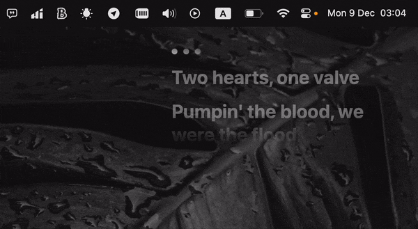

# LyricsOver

With LyricsOver, you can display synchronized lyrics from Apple Music over any active window, ensuring your favorite songs' words are always front and center.

## Getting Started

1. On first launch, LyricsOver will prompt you to enable accessibility features. This permission is required to retrieve lyrics from Apple Music and display them on your screen.

2. Ensure the "Lyrics" pane is open in Apple Music before using LyricsOver.

3. Use the "Movable" option in the app menu to move or resize the lyrics window to your preferred position.

## Installation

Download LyricsOver from the [releases page](https://github.com/AlexStrNik/LyricsOver/releases).
